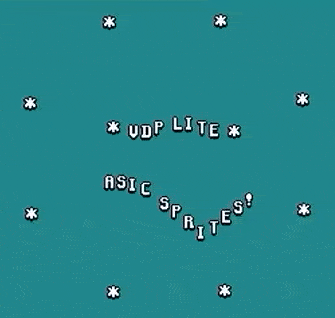
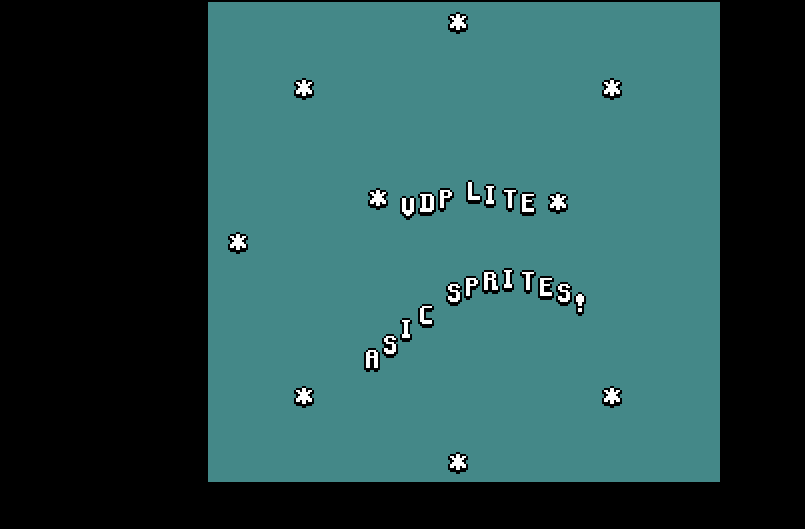

# vdp-lite (SKY130 shuttle)



This is a basic sprite generator that can be controlled using the PicoRV32 + WB interface of the Caravel SoC. It outputs 640x480@60Hz video with pixels doubled to 320x240. The sides of the screen are clipped by 64 pixels each to reduce the "FF RAM" address width to 8bits. If all goes well, OpenRAM could be used in future runs to relax some of these constraints, restore features etc.

The sprites can have arbitrary screen positions and can select any glyph from the character ROM.

It is a minimized variant of the VDP found in the [icestation-32](https://github.com/dan-rodrigues/icestation-32) project. The rest of the system is not included although minimal serial IO for gamepad reading is included. To fit the time / memory constraints, functionality has either been removed or simplified.

The font included in the character ROM is the [Good Neighbours pixel font](https://opengameart.org/content/good-neighbors-pixel-font) by Clint Bellanger, which is public domain.

## Building

### User project GDS

```
cd openlane
make vdp_lite_user_proj
```

The /openlane directory contains  a symlink to a `$readmemh` file to be treated as ROM. Attempting to build it a different way or with a different CWD may fail.

The resulting `vdp_lite_user_proj.gds` and `vdp_lite_user_proj.lef` should be moved to the project `/gds` and `/lef` directories respectively, to be consistent with how others in caravel are handled.

Then to build the user project wrapper:

```
cd openlane
make user_project_wrapper
```

The resulting GDS / LEF can then be integrated into Caravel

## Tools used

For the included build artefacts in this repo, these tools and their respective commits were used:

* open_pdks: `8688323e12530b9ced04b8053a6c4699b28402fc`
* openlane: `817314be3c7996f62b6cb499e35e2107d4b822e2`

## Tests

Testbenches that instantiate the `caravel` SoC running tests software.

* `video_frame`: Outputs a complete video frame using dumped RGBHV outputs, which is then converted using a Python script to a PNG.
* `gamepad`: Exercises the gamepad serial IO and (tentative) LED outputs.

## (TODO: GL tests and proper Makefile support)

A sample PNG from the `video_frame` is shown below. It takes a very long time to complete and can be manually cut short to show a partial frame. The black borders represent the front/backporches.



## TODO

* Configured config.tcl files appropriately for DRC clean design.
* SPDX license headers.
* Extract this README.md section.
* Extract project-specific contents to separate repo.

The original contents of the README file follow:

# CIIC Harness  

A template SoC for Google SKY130 free shuttles. It is still WIP. The current SoC architecture is given below.

<p align=”center”>
 
</p>

## Getting Started:

Start by cloning the repo and uncompressing the files.
```bash
git clone https://github.com/efabless/caravel.git
cd caravel
make uncompress
```

Install the required version of the PDK by running the following commands:

```bash
export PDK_ROOT=<The place where you want to install the pdk>
make pdk
```

Then, you can learn more about the caravel chip by watching these video:
- Caravel User Project Features -- https://youtu.be/zJhnmilXGPo
- Aboard Caravel -- How to put your design on Caravel? -- https://youtu.be/9QV8SDelURk
- Things to Clarify About Caravel -- What versions to use with Caravel? -- https://youtu.be/-LZ522mxXMw

## Aboard Caravel:

Your area is the full user_project_wrapper, so feel free to add your project there or create a differnt macro and harden it seperately then insert it into the user_project_wrapper. For example, if your design is analog or you're using a different tool other than OpenLANE.

If you will use OpenLANE to harden your design, go through the instructions in this [README.md][0].

Then, you will need to put your design aboard the Caravel chip. Make sure you have the following:

- Magic installed on your machine. We may provide a Dockerized version later.
- You have your user_project_wrapper.gds under `./gds/` in the Caravel directory.

Run the following command:

```bash
export PDK_ROOT=<The place where the installed pdk resides. The same PDK_ROOT used in the pdk installation step>
make
```

This should merge the GDSes using magic and you'll end up with your version of `./gds/caravel.gds`. You should expect hundred of thousands of magic DRC violations with the current "development" state of caravel.

## Managment SoC
The managment SoC runs firmware that can be used to:
- Configure User Project I/O pads
- Observe and control User Project signals (through on-chip logic analyzer probes)
- Control the User Project power supply

The memory map of the management SoC can be found [here](verilog/rtl/README)

## User Project Area
This is the user space. It has limited silicon area (TBD, about 3.1mm x 3.8mm) as well as a fixed number of I/O pads (37) and power pads (10).  See [the Caravel  premliminary datasheet](doc/caravel_datasheet.pdf) for details.
The repository contains a [sample user project](/verilog/rtl/user_proj_example.v) that contains a binary 32-bit up counter.  </br>

<p align=”center”>

</p>

The firmware running on the Management Area SoC, configures the I/O pads used by the counter and uses the logic probes to observe/control the counter. Three firmware examples are provided:
1. Configure the User Project I/O pads as o/p. Observe the counter value in the testbench: [IO_Ports Test](verilog/dv/caravel/user_proj_example/io_ports).
2. Configure the User Project I/O pads as o/p. Use the Chip LA to load the counter and observe the o/p till it reaches 500: [LA_Test1](verilog/dv/caravel/user_proj_example/la_test1).
3. Configure the User Project I/O pads as o/p. Use the Chip LA to control the clock source and reset signals and observe the counter value for five clock cylcles:  [LA_Test2](verilog/dv/caravel/user_proj_example/la_test2).

[0]: openlane/README.md
